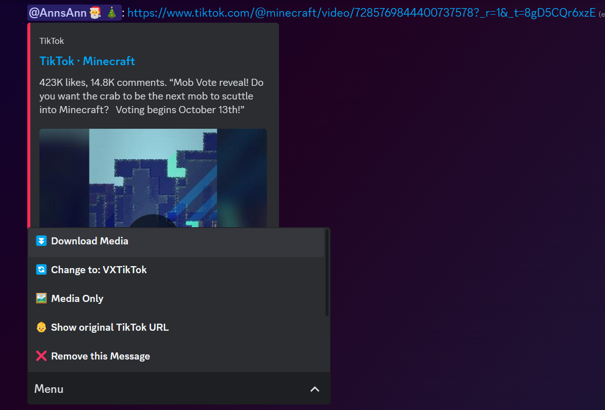

# Sphene Family of Projects

### This is a monorepo for the 3 Sphene (CaTiSiO5) projects.

## [Sphene](./sphene/README.md)

Sphene is a discord bot that replaces twitter, bluesky, instagram and tiktok links with various other sources that aim to fix the bug/broken embeds these sites have.

### Invite

#### [CLICK HERE TO INVITE THE BOT](https://discord.com/api/oauth2/authorize?client_id=1134171949338214491&permissions=292057802816&scope=bot)

### Example

## [Sphene Config](./sphene_config/README.md)

Sphene Config is a shard of the Sphene discord bot that allows you to configure the bot via slash commands.

## [Titanite](./titanite/README.md)

Titanite is (loosely) based on [Sphene](https://github.com/AnnsAnna/sphene) with completely different goals and vastly different features. 

This version downloads the image of the tweet and includes a backlink to the original tweet. It is intended for preservation (Basically a Twitter/X bookmarks alternative that is actually good). It supports images, videos, text and mosaics, always trying to find the best way to showcase the content as directly as possible.

When sending it a tweet via DMs it'll automatically send it to a designated channel, it'll also include the original tweet link for easier moving to other channels / categories.

### Example

## [Thorium](./thorium/README.md)

Thorium is a library that extracts various links either to convert them to better alternatives or to directly download the content within. It is used to run Sphene and Titanite but can be used with any program you want.