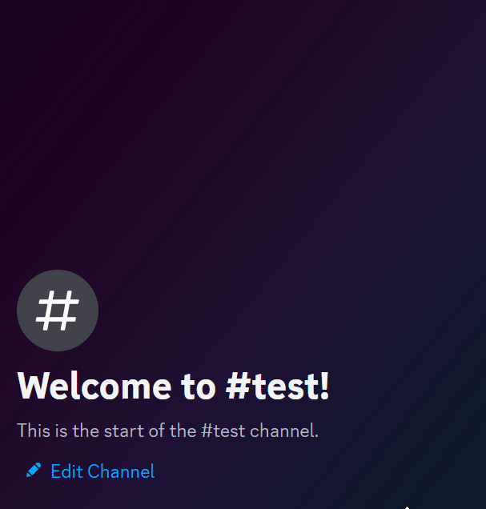

## Titanite

Titanite is a based of [Sphene](https://github.com/AnnsAnna/sphene) with completely different goals. 

This version downloads the image of the tweet and includes a backlink to the original tweet. It is intended for preservation (Basically a Twitter/X bookmarks alternative that is actually good).

When sending it a tweet via DMs it'll automatically send it to a designated channel, it'll also include the original tweet link for easier moving to other channels / categories.

## Example

## Warning

Compared to the public [Sphene](https://github.com/AnnsAnna/sphene) bot this bot is intended to only ever be used by one server/person given the differences, also, compared to [Sphene](https://github.com/AnnsAnna/sphene) this bot is more-so a personal project with no support, I'd strongly recommend to use [Sphene](https://github.com/AnnsAnna/sphene) instead unless you know what you are doing.

## Run Yourself

To run it yourself either compile the code via `cargo build --release`.

### License

This project is licensed under EUPLv1.2 see [HERE](./LICENSE).
